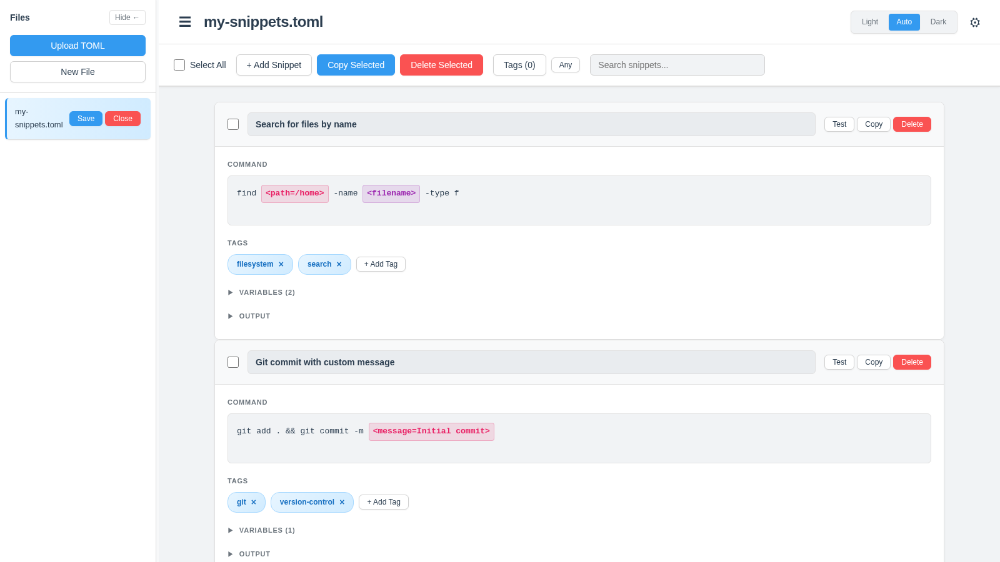
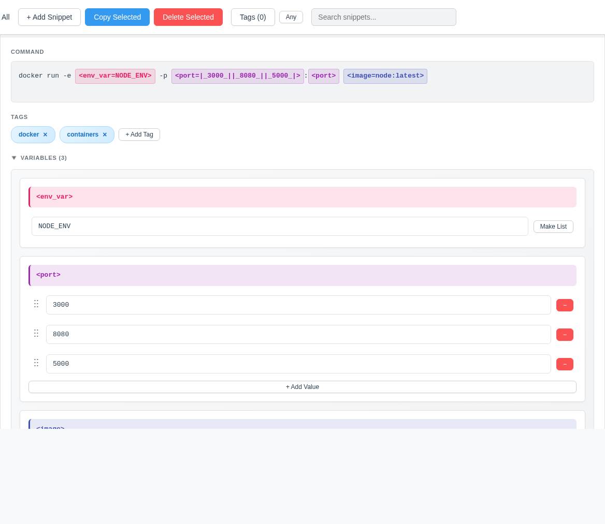
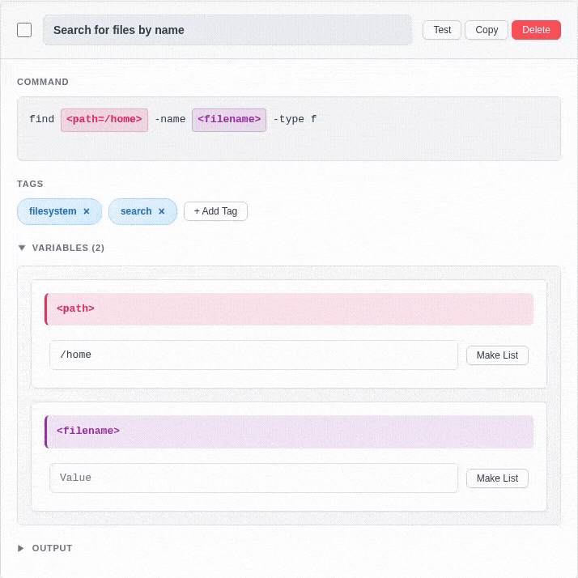
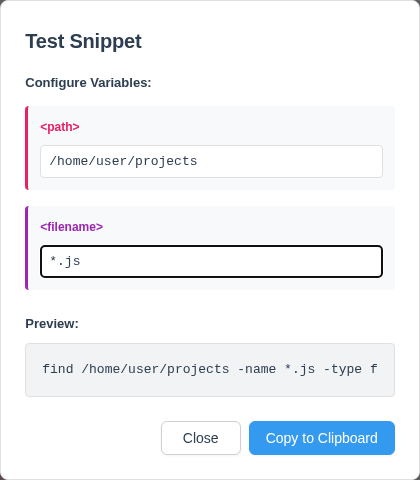
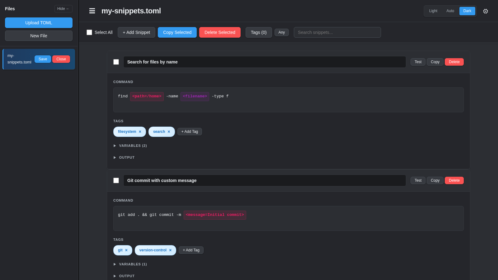

# Veterinarian 🩺

> A powerful browser-based editor for your [pet](https://github.com/knqyf263/pet) CLI snippet files.

<div align="center">


### ✨ [Try it now - No installation required!](https://asocpro.github.io/veterinarian) ✨


</div>

## What is Veterinarian?

Veterinarian is a browser-based TOML editor specifically designed for [pet](https://github.com/knqyf263/pet) snippet files. It runs entirely in your browser with **no server or installation required**. The standout feature is its intelligent variable management system that makes editing complex command-line snippets with variables a breeze.

**Privacy-First**: All data stays on your device. Files are stored in browser localStorage and never leave your computer. No accounts, no servers, no tracking.

**New to pet?** [Pet](https://github.com/knqyf263/pet) is a popular CLI tool for managing command-line snippets. Veterinarian makes editing those snippets visual and intuitive.

<!-- Screenshot: Main interface overview showing snippet list and sidebar -->


## Why Use Veterinarian?

- 🎨 **Visual Variable Editor**: Color-coded variables with drag-and-drop reordering, list management, and real-time command updates
- 🔍 **Powerful Filtering**: Fuzzy search and multi-tag filtering to find snippets instantly
- 🧪 **Test Before You Run**: Preview interpolated commands with a built-in test dialog
- 🔒 **100% Private**: All data stored locally in your browser - nothing sent to any server
- 🌓 **Dark Mode**: Easy on the eyes with theme customization
- 📱 **Works Everywhere**: Desktop, tablet, or mobile - no installation needed

## ✨ Key Features

### 🎨 Advanced Variable Management (The Killer Feature!)

<!-- Screenshot: Variables section expanded showing color-coded variables -->


The variable editor automatically parses pet's variable syntax and gives you visual controls:
- **Color-coded variables** - Each variable gets a unique, persistent color
- **List management** - Add/remove/reorder list values with drag-and-drop
- **Real-time updates** - Command updates as you type
- **Smart syntax** - Automatically handles `<var>`, `<var=value>`, and `<var=|_val1_||_val2_|>` formats

<!-- GIF: Show editing a variable and seeing the command update in real-time -->


### 🧪 Test Snippets Before Running

<!-- Screenshot: Test dialog showing variable inputs and interpolated command preview -->


Preview exactly what will run before you copy to clipboard:
- Fill in variable values or select from dropdowns
- See live preview of the final command
- Copy interpolated command with one click

### 🔍 Powerful Search & Filtering

- **Fuzzy search** across descriptions and commands
- **Multi-tag filtering** with All/Any matching modes
- **Tag management** - add/remove tags with simple +/× buttons

### 📁 Multi-File Workflow

- Open and edit multiple TOML files simultaneously
- Visual dirty tracking for unsaved changes
- Download edited files back to disk
- Rename files directly in the sidebar
- Auto-save to localStorage (all data stays on your device)

### 🎨 Customizable UI

<!-- Screenshot: Dark mode -->


- Light, dark, and auto themes
- Resizable and collapsible sidebar
- Customizable variable colors
- Mobile-friendly responsive design

## 🚀 Quick Start

### Option 1: Online (Recommended)
**Just visit [https://asocpro.github.io/veterinarian](https://asocpro.github.io/veterinarian)** - That's it!

### Option 2: Run Locally
```bash
# Clone the repo
git clone https://github.com/asocpro/veterinarian.git
cd veterinarian

# Open in browser (any web server works)
python3 -m http.server 8000
# Then visit http://localhost:8000
```

## 📖 How to Use

1. **Upload or create** - Click "Upload .toml" to open existing pet files, or "New File" to start fresh
2. **Edit snippets** - Click any field to edit. Expand Variables section to manage command variables
3. **Test it out** - Click "Test" to preview the interpolated command before running
4. **Save your work** - Click the download icon to save your edited file

That's it! No complex setup, no configuration files, just edit and go.

**Note**: Your files are automatically saved to localStorage and persist across sessions. Your data never leaves your browser.

## 🤔 Pet vs Veterinarian - What's the Difference?

| Feature | pet CLI | Veterinarian |
|---------|---------|--------------|
| Edit snippets | Text editor required | Visual web interface |
| Variable management | Manual TOML editing | Color-coded with drag-and-drop |
| Search snippets | Command-line only | Fuzzy search + tag filtering |
| Test commands | Copy & modify manually | Preview dialog with interpolation |
| Multi-file editing | Switch files in editor | Side-by-side file tabs |
| Platform | CLI tool (installed) | Browser-based (no install) |

**Use them together!** Edit your snippets in Veterinarian, then use pet on the command line to search and execute them.

## 📄 Pet Snippet Format Reference

Veterinarian is fully compatible with pet's TOML format:

```toml
[[snippets]]
  description = "Search for a file by name"
  command = "find <path> -name <filename>"
  tag = ["filesystem", "search"]
  output = ""

[[snippets]]
  description = "Git commit with message"
  command = "git commit -m <message=initial commit>"
  tag = ["git"]
  output = ""
```

**Variable Syntax:**
- `<var>` - Simple variable placeholder
- `<var=value>` - Variable with default value
- `<var=|_val1_||_val2_||_val3_|>` - Variable with list of options

Veterinarian handles all of this automatically with its visual variable editor!

---

## 🛠️ For Developers

<details>
<summary><strong>Technology Stack</strong></summary>

- **Vanilla JavaScript**: No frameworks, just clean ES6+ code
- **Web Components**: Shadow DOM for component encapsulation
- **TOML Parsing**: [@ltd/j-toml](https://www.npmjs.com/package/@ltd/j-toml) (v1.38.0)
- **Fuzzy Search**: [Fuse.js](https://fusejs.io/) (v6.6.2)
- **No build process**: Everything runs directly in the browser

</details>

<details>
<summary><strong>Project Structure</strong></summary>

```
veterinarian/
├── index.html              # Main application entry point
├── styles.css              # Shared styles (layout, colors, buttons)
├── components/
│   ├── file-list.js       # Sidebar file list component
│   ├── snippet-list.js    # Main snippet list with filtering
│   ├── snippet-item.js    # Individual snippet editor
│   └── settings-dialog.js # Settings dialog component
├── utils/
│   ├── toml-parser.js     # TOML parsing and stringification
│   ├── var-parser.js      # Variable extraction and command updating
│   ├── state-persistence.js # LocalStorage state management
│   └── drag-reorder.js    # Reusable drag-and-drop utility
└── docs/
    └── initial.md         # Project documentation and status
```

</details>

<details>
<summary><strong>Component Architecture</strong></summary>

The application uses a modular Web Component architecture:

- **file-list**: Manages the sidebar file list
- **snippet-list**: Handles filtering, search, and snippet display
- **snippet-item**: Individual snippet editor with variable management

Components communicate via global functions exposed on the `window` object:
- `window.createNewFile()` - Create a new TOML file
- `window.selectFile(index)` - Switch to a different file
- `window.closeFile(index)` - Close a file
- `window.markFileDirty()` - Mark current file as modified
- `window.updateSnippetsInFile(snippets)` - Update snippets in current file

</details>

<details>
<summary><strong>Browser Compatibility</strong></summary>

- Chrome/Edge: ✅ Full support
- Firefox: ✅ Full support
- Safari: ✅ Full support
- IE11: ❌ Not supported (requires modern ES6+ features)

</details>

## 🎯 Roadmap

<details>
<summary><strong>Completed Features ✅</strong></summary>

- [x] File upload and management
- [x] TOML parsing with case-insensitive field handling
- [x] Snippet editing (description, command, tags, output)
- [x] Tag filtering and fuzzy search
- [x] Variable extraction and color-coding
- [x] Variable editing with real-time command updates
- [x] List variable support with drag-and-drop reordering
- [x] Command reconstruction with smart syntax handling
- [x] Download/save functionality
- [x] Dark mode theme support
- [x] File renaming capability
- [x] Test snippets with variable interpolation preview
- [x] Copy interpolated commands to clipboard
- [x] Click variable in command to highlight in variables section
- [x] Collapsible sidebar for mobile/small screens
- [x] Settings dialog with customization options
- [x] Copy snippets between files

</details>

<details>
<summary><strong>Planned Enhancements 🚀</strong></summary>

- [ ] Keyboard shortcuts (Ctrl+S to save, etc.)
- [ ] Drag-and-drop snippet reordering
- [ ] Import/export individual snippets
- [ ] Duplicate snippet button
- [ ] Syntax highlighting in command field
- [ ] Command history tracking

</details>

## 🤝 Contributing

This is a personal project, but feel free to fork and customize for your needs! If you find bugs or have feature suggestions, please open an issue on GitHub.

## 📜 License

This project is provided as-is for personal use. The [pet CLI tool](https://github.com/knqyf263/pet) is a separate project by [knqyf263](https://github.com/knqyf263).

## 🙏 Acknowledgments

- [pet](https://github.com/knqyf263/pet) by [knqyf263](https://github.com/knqyf263) - The excellent CLI snippet manager this tool supports
- [@ltd/j-toml](https://www.npmjs.com/package/@ltd/j-toml) - Robust TOML parsing library
- [Fuse.js](https://fusejs.io/) - Lightweight fuzzy-search library

---

<div align="center">

**Why "Veterinarian"?** Because it's a tool to "doctor up" your **pet** snippet files! 🩺

Made with ☕ for command-line enthusiasts

</div>
